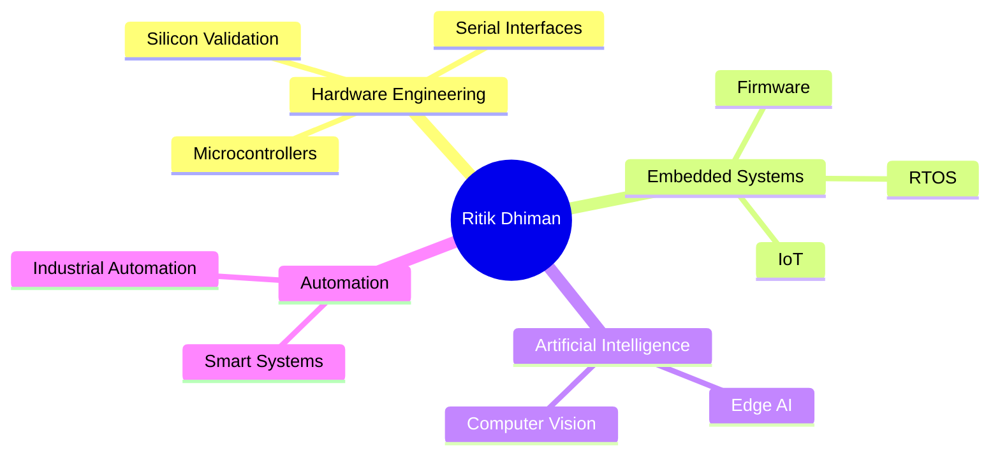

<div align="center">


</div>

<h1 align="center">⚡ Hardware Engineer | Embedded Systems Developer ⚡</h1>

<p align="center">
From <b>Silicon Validation</b> to <b>AI-Powered Edge Devices</b>
</p>

---

## 👨‍💻 About Me

```yaml
Name: Ritik Dhiman

Role:
  Hardware & Embedded Systems Engineer

Specialization:
  - Microcontroller Development
  - Pre-Silicon Validation
  - Post-Silicon Validation
  - Embedded Firmware Development
  - Serial Interface Technologies
  - AI & Edge Intelligence
  - IoT Systems
  - Computer Vision
  - Industrial Automation

Passion:
  Building reliable, intelligent, and scalable systems.
```

---

## ⚙️ Engineering Pipeline

```text
Silicon
   │
   ▼
Pre-Silicon Validation
   │
   ▼
Post-Silicon Validation
   │
   ▼
Firmware Development
   │
   ▼
Embedded Systems
   │
   ▼
IoT Connectivity
   │
   ▼
AI + Computer Vision
   │
   ▼
Automation
```

---

## 🔥 Core Expertise

<table>
<tr>
<td>

### 🧪 Validation

- Pre-Silicon Verification
- Post-Silicon Validation
- Debug & Root Cause Analysis
- Test Development

</td>
<td>

### ⚡ Embedded

- STM32
- ESP32
- ARM MCUs
- RTOS
- Bare-Metal Development

</td>
</tr>

<tr>
<td>

### 📡 Serial Interfaces

- I²C
- SPI
- UART
- CAN
- USB

</td>
<td>

### 🚀 Emerging Tech

- Artificial Intelligence
- IoT
- Computer Vision
- Edge Computing
- Automation

</td>
</tr>
</table>

---

## 💻 Tech Stack

### Languages


### Microcontrollers & Hardware


### Communication Protocols


### AI | IoT | Vision


---

## 📊 Current Focus

```text
Microcontroller Development     ████████████████████ 100%
Pre/Post Silicon Validation     ███████████████████░ 95%
Embedded Systems                ███████████████████░ 95%
Serial Interfaces               ███████████████████░ 95%
IoT Solutions                   ██████████████████░░ 90%
Computer Vision                 ████████████████░░░░ 80%
AI at the Edge                  ███████████████░░░░░ 75%
Automation                      █████████████████░░░ 85%
```

---

## 🧠 Technology Mind Map



---

## 📈 GitHub Analytics

<div align="center">


</div>

<div align="center">


</div>

---

## 🐍 Contribution Snake

> Enable GitHub Actions first, then add the Snake workflow.


---

## 🚀 Mission

```text
Design Hardware
      ↓
Validate Silicon
      ↓
Develop Firmware
      ↓
Connect Everything
      ↓
Add Intelligence
      ↓
Automate the Future
```

---

<div align="center">

### ⚡ Engineering Intelligence from Silicon to Autonomous Systems ⚡


</div>
